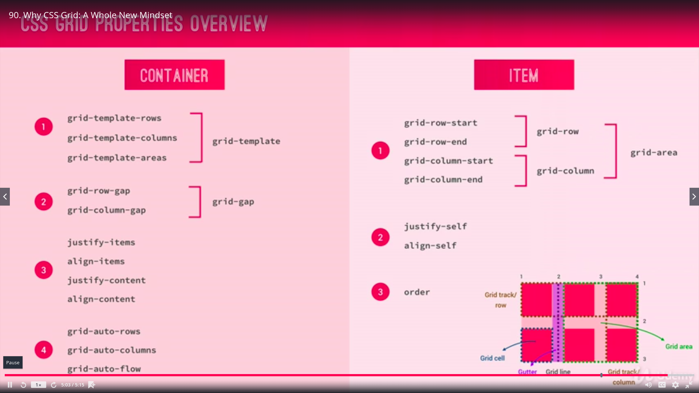
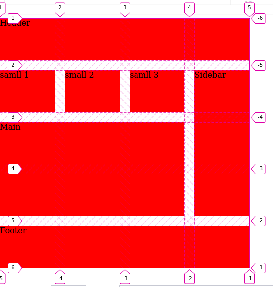
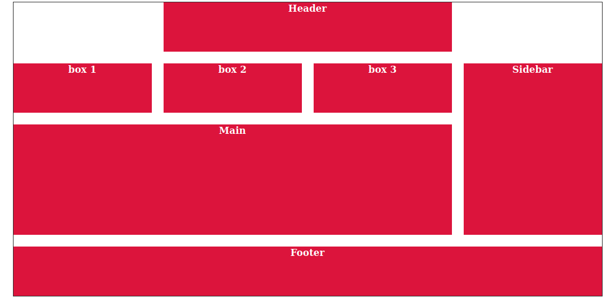

# CssGrids
  

## Outline

1. Overview.
2. Terminology.
3. Propterties.  

   1.grid-template-rows.
   2.grid-template-columns.
   3.grid-row-gap.
   4.grid-column-gap.
   5.grid-gap.
   6.fr
   7.grid-row-start.
   8.grid-row-end.
   9.grid-column-start.
   10.grid-column-end.
   11.grid-row.
   12.grid-column.
   13.grid-area.

4. Grid Naming
5. Implicit vs Explicit grid.
5. Links

## Overview

1. Bidirectional layout control.
2. Content -> item -> self.  

   1.{prefix}-content : @container-level aligns the whole container.
   2.{prefix}-item : @container-level aligns container **children**.
   1.{prefix}-self : @item-level overrides container derived alignment.

## Terminology

|   |   |   |   |   |
|---|---|---|---|---|
| Grid Container  | display:grid  | 1. All direct children become  **grid items** | |   |
| Column Axis  : positive y |   |   |   |   |
|  Row Axis: positive x  |   |   |   |   |
|  Grid lines |   | 1.numbered for row and col  |   |   |
|  Grid track |   | 1.space between two grid lines i.e row and column  |   |   |
|  Gutter |   | 1.space between rows or colums  |   |   |

## Propterties

1. units can be mixed.
2. Percentage as unit will not take gutters into consideration.
3. Multiple grid items can be in same cell. Manipulation with z-index.
4. Negative values starts from reverse order. i.e -1 i last.
5. fr will fill up remaining space but is never smaller than min-content.

|| Property  |Description   | 
|---|---|---|
|1|  grid-template-rows :**x unit y unit**| 2 rows with specified width  | 
|2|  grid-template-rows : **x unit y unit**| 2 rows with specified width  | 
|3|  grid-template-rows : **repeat(number, x unit) y unit**| n +1 rows with specified width  | 
|4|  grid-template-colums : **x unit y unit**|2 columns with specified width |
|5|  grid-template-colums :**repeat(number, x unit) 1fr**|n+1 columns with specified width and last column spans remaining space |
|6|  grid-template-colums :**repeat(number, 1fr)**|n columns equal width|
|7|  grid-row-gap: **x unit** | row gutter   | 
|8|  grid-column-gap: **y unit** |column gutter   |
|9|  grid-gap: **x unit** |row-column gutter   |
|---|||
||  **MOVING GRID ITEMS** |   |
|---|||
|10|  grid-row-start: **row number** | move to row  |
|11|  grid-row-end: **row number** |cell end at before this row   |
|12|  grid-column-start: **column number** |row-column gutter   |
|13|  grid-column-end: **column number** |row-column gutter   |
|14|  grid-row: **number / number** |row-column gutter   |
|15|  grid-column: **number / number** |row-column gutter   |
|16|  grid-area: **number / number / number / number** |row-column gutter   |
|---|||
||  **IMPLICIT GRID** |  |
|---|||
|19|  grid-auto-flow: **row/column  dense** |grid overflow paradigm, dense removes empty cells |
|20|  grid-auto-rows: **x units** |height of implicit grid cells row overflow|
|20|  grid-auto-columns: **x units** |height of implicit grid cells column overflow|
|---|||
||  **SPANNIG GRID ITEMS** |  |
|---|||
|17|  grid-row: **number /span number** |   |
|18|  grid-column: **number /negative number** |   |
|---|||
||  **ALIGN GRID ITEMS** |  |
|---|||
||  align-items: **string** | align across column axis.@container level  |
||  justify-items: **string** |align across row axis.@container level  |
||  align-self: **string** | override align items.@item level  |
||  justify-self: **string** | override justigy items.@item level  |
|---|||
||  **ALIGN GRID TRACKS** |  |
||  justify-content: **string** | align across row axis.@container level |
||  align-content: **string** | align across column axis.@container level |
|---|||
||  align-items: **string** | align across column axis.@container level  |
||  **NAMING GRID** |   |
|---|||
||  grid-template-areas: gigantic syntax refer mdn |   |
|---|||
||  **CONTENT BASED** |**PROPERTY VALUES**  |
||  max-content | maximum dimension without linebreak  |
||  min-content |minimum dimension without overflow   |
||  minmax(min, max) |dimension range  |
|---|||
||  **AUTOFILL & AUTO FIT** |  |
||  grid-template-columns:**repeat(autofill, width)**|creates tracks of width and fills the container with available items and rest are empty|
||  grid-template-columns:**repeat(autofit, width)**|creates tracks of width and fills the container with available items and rest are empty and collapsed.|

## Grid Naming

### Grid Lines Naming

1. In repeat common name results in a NAMESET in a format "[name] number".

### Grid Area Naming

1. In repeat common name results in a NAMESET in a format "[name] number".

## Implicit vs Explicit grids.

## Links

1.[Basic page Layout Codepen](https://codepen.io/sumitkumar25/pen/BaNYRzy)

___
2.[Page Layout GridArea Codepen](https://codepen.io/sumitkumar25/pen/NWqyvqE)

3.[Grid min max content code pen](https://codepen.io/sumitkumar25/pen/NWqywgX)

## forward content.

1. Grid placement algorithm.
2. Subgrid
3. extend vs mixin

